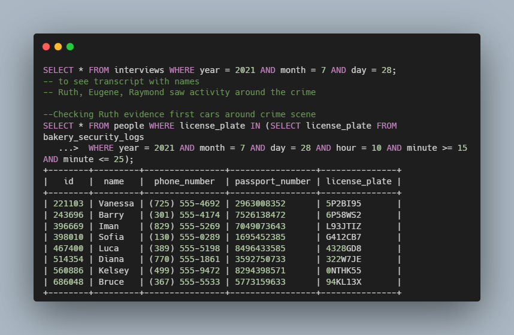

# SQL Fiftyville - CS50

### Description

Writting SQL queries to solve a crime mystery.

In this project I had to decide how to go about solving a mystery. 

The Fiftyville authorities have taken some of the town’s records from around the time of the theft and prepared a SQLite database for you, fiftyville.db, which contains tables of data from around the town. You can query that table using SQL SELECT queries to access the data of interest to you. Using just the information in the database, my task was to solve the mystery.

### How to use

Execute sqlite3 fiftyville.db to begin running queries on the database.
While running sqlite3, executing .tables will list all of the tables in the database.
While running sqlite3, executing .schema TABLE_NAME, where TABLE_NAME is the name of a table in the database, will show you the CREATE TABLE command used to create the table. This can be helpful for knowing which columns to query!

### Code Snippet

### Links

For more information about SQL Fiftyville visit: 

---------------------------------
[cs50 course](https://cs50.harvard.edu/x/2022/psets/7/fiftyville/)
---------------------------------------------------------------

